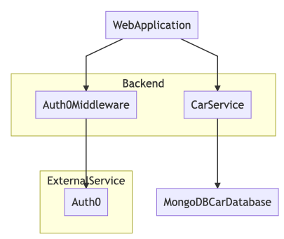
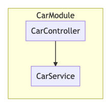

This is the implementation of the project for the SOA University subject.

The implemented system consists of a backend exposing APIs,a frontend consuming the APIs and presenting information to the user, and a database for storing the information.
* The database is a MongoDB instance storing cars
* The backend is written using NestJS and consists of a module abstracting the access to the database via the exposed CRUD APIs
* The frontend is written using React with TypeScript and offers views for all the cars, for a specific car, for creating a new car and for and editing a car. The delete option is also available in the view presenting the grid of all the cars
* For authentication and security purposes, the Auth0 external service is used as a middleware validating the API requests coming from the frontend. An user needs to be logged in for creating, editing or deleting a car, but not for seeing the already existing cars.

The following diagram presents an overview of the architecture of the system.

The following diagram presents the components of the CarService backend component.

The controller is responsible only for exposing the APIs and for parsing the request, whose parameters are passed to the service for actually performing the requested operation in the database.